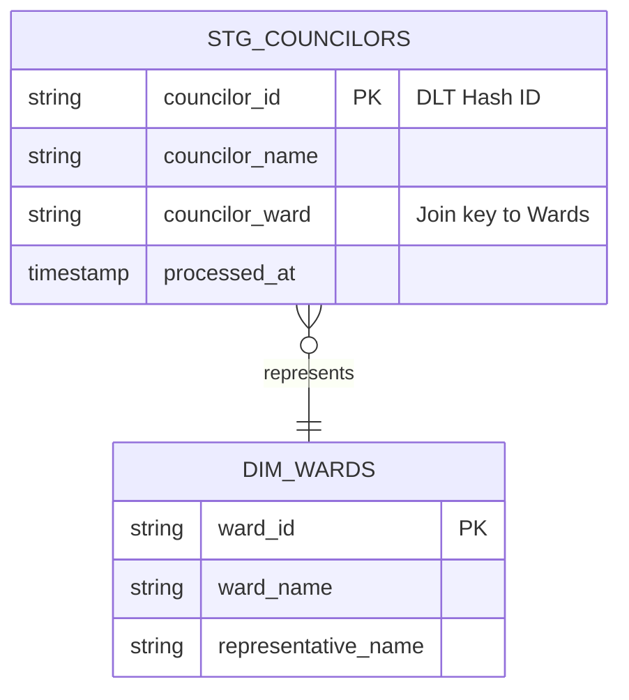

# 🏛️ Architecture: Zero-Idle Data Refinery

The **Somerville Civic Pulse** is built on a serverless, agentic architecture designed for maximum performance at near-zero idle cost.

---

## 🗺️ Data Topography (ERD)

The following diagram illustrates the relationship between our cleansed **Silver Layer** dimensions and facts for the Councilor refinery line.

---

## 🛠️ The Technical Stack

We adhere to the **Sovereign Engine** standards:

1.  **Ingestion**: `dlt` (embedded Python) for declarative source-to-vault mirroring.
2.  **Refinery**: `dbt` (DuckDB adapter) for high-speed local transformation.
3.  **Warehouse**: **DuckDB + GCS** (Standard Parquet) enabling high-concurrency serverless query execution.
4.  **Plating**: **Evidence.dev** (Vite + Markdown) for sub-second dashboard rendering.
5.  **Compute**: Google Cloud Run (Scheduled Jobs) for zero-latency refinery cycles.

---
*Certified by the Sovereign Architect | Mission Code: REQ-003-ARCH* 🏮
