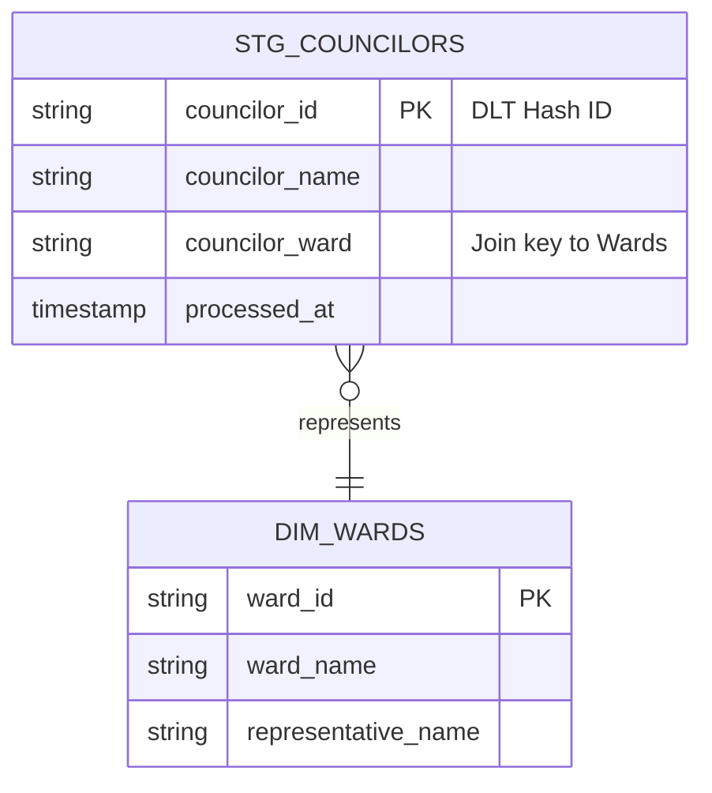

# WWWarehouse: Entity Relationship Diagram (ERD) 🗺️

This document defines the schema topology and logical relationships across the Medallion layers.

## 🏛 1. Core Refinery Schema
The following diagram represents the current state of the **Councilor** and **Public Safety** refinery lines.

## 📋 2. Relationship Catalog

| Relationship | Cardinality | Join Logic | Status |
| :--- | :--- | :--- | :--- |
| `stg_councilors` -> `dim_wards` | Many-to-One | `councilor_ward` = `ward_id` | 🏗 Planned |

---
*Created by the Wong Way Assistant | April 2026*
