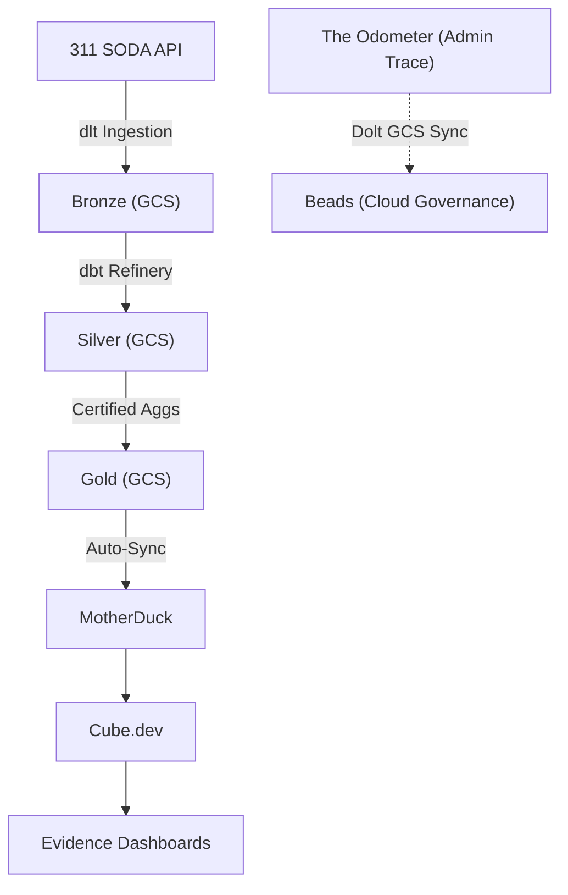

# System Design: The WWWarehouse Data Factory 🏗️

**Architect:** Wong Way Assistant | **Status:** Blueprint Locked | **Date:** April 2026

## 1. Executive Summary
The **Wong Way Warehouse (WWWarehouse)** is an "On-Demand Data Lakehouse" architected for **Zero-Idle** operational costs and **Cloud Sovereignty**. It prioritizes the delivery of **Knowledge Products** (certified metrics) over generic ETL pipelines. The factory is 100% executable in the cloud while maintaining an "Agentic Brain" (Llama/Kilo) for autonomous self-healing.

---

## 2. The "Zero-Idle" Technical Stack (ZIST)
We minimize persistent infrastructure to achieve a near-$0/month baseline cost.

*   **Ingestion Engine:** `dlt` (Python-native data load tool).
*   **Refinery (Compute):** `dbt-duckdb` (executing on GCP Cloud Run Jobs).
*   **Storage (The Hive):** **GCS (Google Cloud Storage)** in Parquet format.
*   **Semantic Layer:** **Cube.js** (Postgres-compatible SQL API via Cloud Run).
*   **Persistence (Front Door):** **MotherDuck** (for high-concurrency BI caching).
*   **Delivery (BI):** **Evidence.dev** (Static-hosted, code-first dashboards).

---

## 3. High-Level Architecture (HLD)

---

## 4. Key Architectural Pillars

### 4.1. Medallion Methodology (The Assembly Line)
*   **Bronze**: Raw landing zone (Deduped via `QUALIFY`).
*   **Silver**: Cleaned, conformed Dimension and Fact tables.
*   **Gold**: High-value, aggregate views optimized for MotherDuck caching.

### 4.2. Cloud Sovereignty (Laptop Independence)
The production factory is 100% independent of the developer's hardware. 
- **Governance Persistence**: The **Beads (bd)** ledger lives in a **Dolt** repository with a **GCS Remote** (`gs://warehouse/admin/beads/`). 
- **Execution Sovereignty**: All jobs are containerized and triggered via Cloud Scheduler.

### 4.3. Proof of Trust (E2E Lineage)
We maximize **dbt-native** metadata (Manifests, Doc Blocks, and Exposures) to bridge the gap from SODA API to the Dashboard footer.
- **Lineage Engine**: Mermaid.js renders the E2E path (Source → Refinery → Chart) using the `manifest.json`.
- **The Logic Book**: All transformation and business logic is documented in dbt `.md` doc blocks.

### 4.4. Agentic Self-Healing (Kilo-Heal)
The factory includes an "Immune System" powered by **Kilo** and **Ollama**. 
- Failed ingestion due to schema drift triggers an autonomous repair loop.
- The agent pulls the latest `beads/` state, refactors the `dlt` scripts, and pushes the repair to the repository.

---
*Created by the Wong Way Assistant | April 2026*
